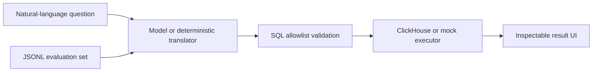

# QueryGuard

QueryGuard is a full-stack natural-language analytics prototype. It translates a question into a deliberately restricted subset of ClickHouse SQL, validates the generated statement against an allowlist, executes it, and returns the SQL beside the result set for inspection.

The repository makes the uncertain parts of an LLM-backed workflow visible: generated output, validation, deterministic fallback behavior, evaluation cases, and execution mode are all explicit.

> **Scope:** this is a portfolio prototype, not a production SQL security boundary. The grammar is supplied as model guidance and the result is validated in application code; the model is **not** constrained with native grammar decoding.

## What it demonstrates

- End-to-end ownership across React, FastAPI, model integration, and deployment
- Natural-language-to-SQL generation with a narrow schema and table allowlist
- Read-only validation before database execution
- A deterministic offline mode for demos, tests, and graceful degradation
- A JSONL evaluation harness with CI-friendly exit codes
- ClickHouse connectivity for local Docker and hosted environments
- Query history, autocomplete, generated SQL, and raw-result inspection

## Architecture



## Safety model

QueryGuard uses several intentionally simple layers:

1. The prompt describes a restricted SQL grammar and one permitted table.
2. The application accepts only a single `SELECT` statement.
3. Comments, joins, additional tables, and mutation/administrative keywords are rejected.
4. The database connection should still use a read-only, least-privilege account.

For a production system, add an AST-based parser, database-enforced permissions, query time and row limits, audit logging, and isolated execution.

## Stack

| Layer | Technology |
| --- | --- |
| Interface | React, TypeScript |
| API | FastAPI, Pydantic |
| Model integration | OpenAI Python SDK |
| Data | ClickHouse |
| Quality | Pytest, JSONL evaluations, GitHub Actions |
| Deployment | Docker, Render-compatible blueprint |

## Run locally

### Offline demo mode

No API key or database is required.

```bash
cd backend
python -m venv .venv
source .venv/bin/activate
pip install -r requirements.txt
MOCK_MODE=true uvicorn app.main:app --reload --port 8000
```

In another terminal:

```bash
cd client
npm ci
npm start
```

Open `http://localhost:3000`.

### Model and database mode

Copy `.env.example`, configure a read-only ClickHouse user, then set:

```bash
export MOCK_MODE=false
export OPENAI_API_KEY=...
export CLICKHOUSE_HOST=localhost
export CLICKHOUSE_PORT=8123
export CLICKHOUSE_DATABASE=default
```

The included `sample_files/MOCK_DATA.csv` and `backend/scripts/init_clickhouse.py` can initialize the example schema.

## API

`POST /nl-query`

```json
{
  "question": "Sum the total balance for users from the last 30 hours"
}
```

Example response in offline mode:

```json
{
  "sql": "SELECT sum(balance) FROM default.MOCK_DATA WHERE signup_date >= subtractHours(now(), 30)",
  "rows": [{ "sum": 505 }],
  "mocked": true,
  "warning": "Mock mode enabled: using heuristic translation + sample data"
}
```

Interactive API documentation is available at `http://localhost:8000/docs`.

## Tests and evaluations

```bash
cd backend
pytest -q
python -m evals.run_evals
```

The unit tests cover request validation, translation behavior, and unsafe SQL rejection. The evaluation runner checks generated SQL against expected patterns and exits non-zero on regression.

## Configuration

| Variable | Purpose | Default |
| --- | --- | --- |
| `MOCK_MODE` | Use the deterministic translator and in-memory results | `true` |
| `OPENAI_API_KEY` | Enable model-backed translation | unset |
| `OPENAI_MODEL` | Model used for translation | `gpt-5` |
| `CLICKHOUSE_HOST` | Database host | unset |
| `CLICKHOUSE_PORT` | HTTP interface port | unset |
| `CLICKHOUSE_DATABASE` | Database name | unset |
| `CLICKHOUSE_USER` | Read-only database user | `default` |
| `CLICKHOUSE_PASSWORD` | Database password | unset |
| `CLICKHOUSE_SECURE` | Enable TLS | `false` |
| `ALLOWED_ORIGINS` | Comma-separated frontend origins | `http://localhost:3000` |

## Deliberate limitations

- The grammar guides generation but is not enforced during token decoding.
- The heuristic fallback covers a small set of example intents.
- The evaluation dataset is intentionally compact and should grow with the grammar.
- Authentication, rate limiting, model-cost telemetry, and persistent evaluation history are not included.

## Next steps

- Replace string validation with a SQL AST allowlist
- Track latency, token usage, validation failures, and fallback rate
- Expand evaluations with adversarial and ambiguous questions
- Add human approval for expensive or unusually broad queries

## License

MIT
